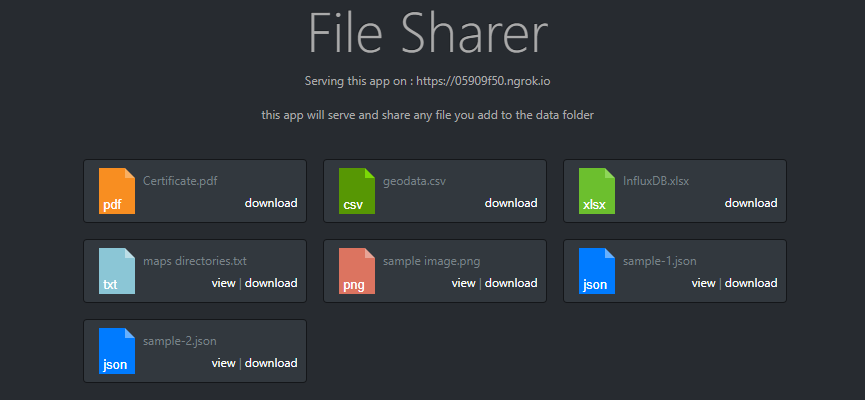

# File Sharer

> Node/Express API for a quick file sharing throw link or downlod, clone this app to any directory and add the files to be shared in the "data" folder.

## Quick Start

you will need Node.js on your machine download from [here](https://nodejs.org/en/download/)

Start :

```bash
# Install dependencies
npm install

# Serve on localhost:5000
nodemon
or
npm run dev (nodemon)
or
npm start

# Routes
GET    /api/v1/data # Get files info

GET    /share/:id/:requestType #view or download
```

:+1:

references:

- [fs Node.js](https://nodejs.org/api/fs.html)
- For the icons: [Demo](https://colorswall.github.io/CSS-file-icons/), [Github](https://github.com/colorswall/CSS-file-icons)

notes:
*this is does not use a MIMEtype, only the file extention. use only with reliable sources*
